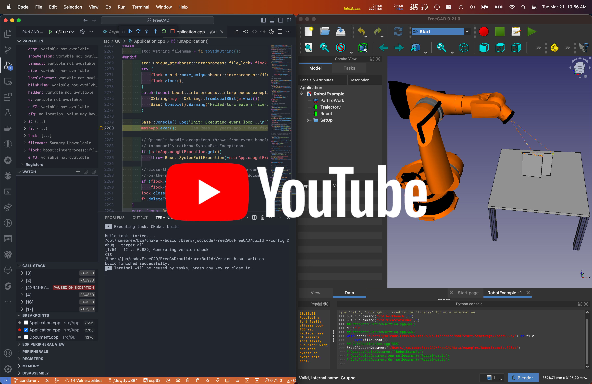
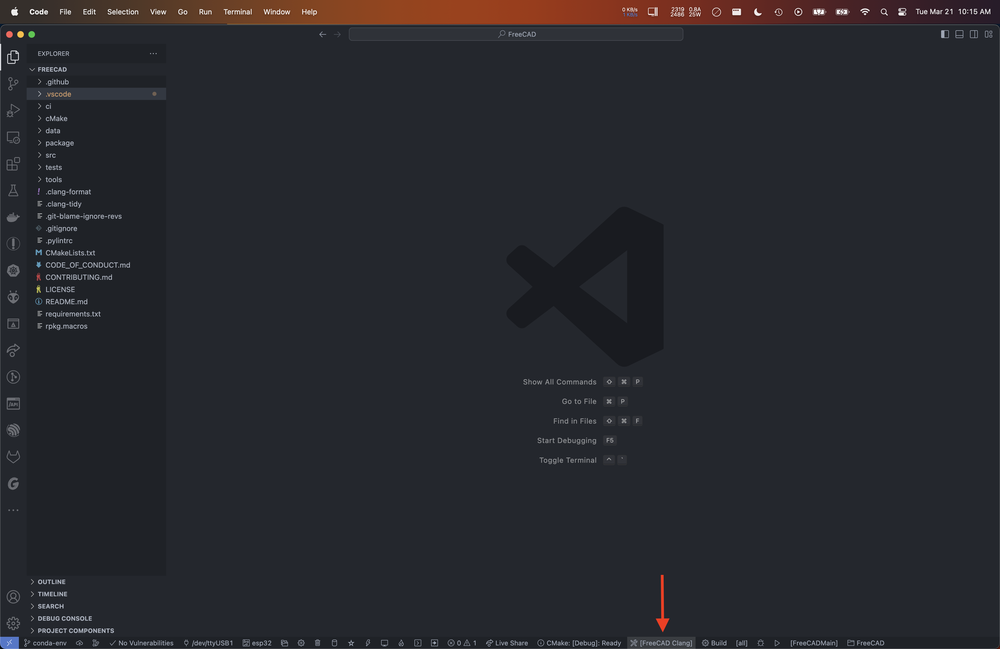
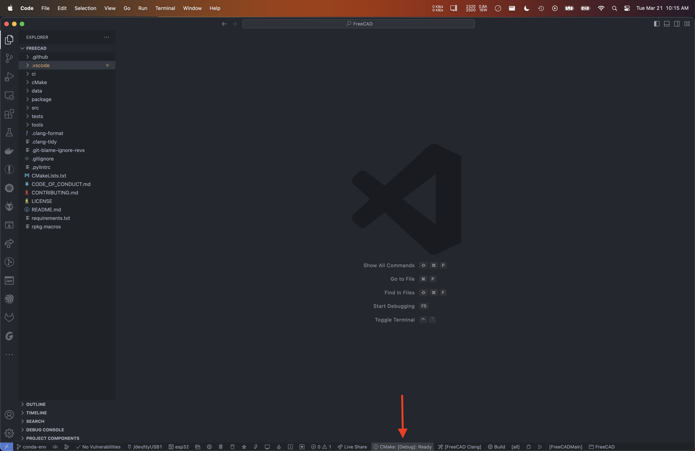
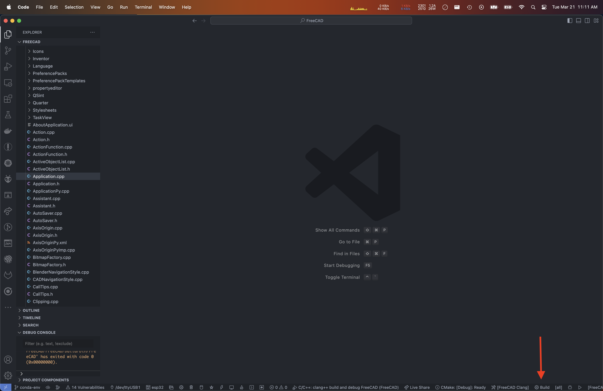

# FreeCAD Build Notes

This is a brief guide to checking out, building, and debugging FreeCAD on macOS tested on Apple Silicon using Visual Studio Code and Conda to provide a consistent development environment.

The video below is somewhat out of date as it:

* builds netgen manually, which is not necessary
* does not call `conda devenv ...` to set up the environment's packages

## Building FreeCAD

1. Install mamba

        brew install mambaforge
        conda init "$(basename "${SHELL}")"
        source ~/.zshrc

2. Clone FreeCAD

        git clone https://github.com/oursland/FreeCAD.git -b conda-devenv

3. Install conda environment for FreeCAD

        cd FreeCAD
        conda env create -p .conda/freecad -f conda/conda-env.yaml
        conda config --add envs_dirs $CONDA_PREFIX/envs
        conda config --add envs_dirs $(pwd)/.conda
        conda config --set env_prompt '({name})'
        conda activate freecad
        conda devenv -f conda/environment.devenv.yml

4. Open FreeCAD in VS Code

        cd ..
        code FreeCAD

    First we need to select our toolchain.  Use the CMake Kit button in the status bar or run the "CMake: Select a Kit" command to choose the "FreeCAD Clang" toolkit.

    

    Next we will select the build variant.  Use the CMake Variant button in the status bar or run the "CMake: Select Variant" command to choose "Debug".

    

    This should now configure CMake to build FreeCAD.

5. Build FreeCAD

    Use the `F7` key or run the `CMake: Build` command

    

## Running and Debugging FreeCAD

Visual Studio Code has been configured with two debug configurations:

* `C/C++: clang++ build and debug FreeCAD`
* `Python: Remote Attach`

The following keys and commands execute common debugging tasks:

* `F5` : `Debug: Start Debugging`
* `Ctrl-F5` : `CMake: Run Without Debugging`
* `F11` : `Debug: Start Debugging and Stop on Entry`

### Debugging C++

The C++ debug configuration proves useful for developing the core FreeCAD application as well as workbenches that may rely upon C++ libraries.

All debugging functionality including breakpoints, variable inspection, register inspection, watch expressions, and call stack investigation are fully operational.

One thing to note is that when one runs the `Pause` (`F6`) operation, there may be considerable delay before the debugger halts execution to permit inspection.

### Debugging Python

FreeCAD has integrated functionality to connect to a remote python debugger using the `ptvsd` tooling present within Visual Studio Code.  

To debug python code:

1. Launch FreeCAD with either `Start Debugging` (`F5`) or `Run Without Debugging` (`Ctrl-F5`)
2. In FreeCAD's menu select `Macro`->`Attach to remote debugger...`

    

3. Select the tab `VS Code` and click the `OK` button.

    

4. In VS Code's `Run and Debug` page, select the `Python: Remote Attach` configuration.

    

5. Click `Start Debugging` (`F5`)

When launching from within VS Code and then debugging Python, you will end up with two debug contexts.  In the floating debug bar, the context will be a drop-down box on the right.  Be sure to select the correct context for the action you wish to execute.

When debugging python, a `Pause` (`F6`) operation will occur when the next Python code is executed.  To trigger this, interact with an element in FreeCAD such as the workbench drop-down menu.

